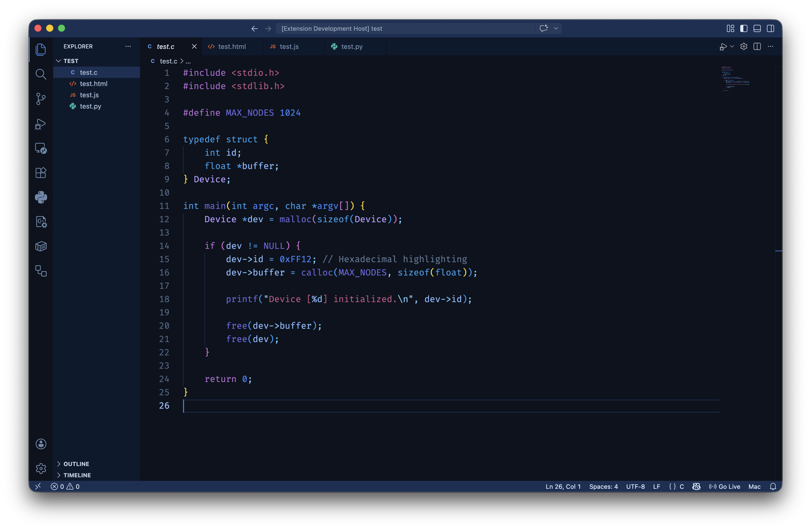
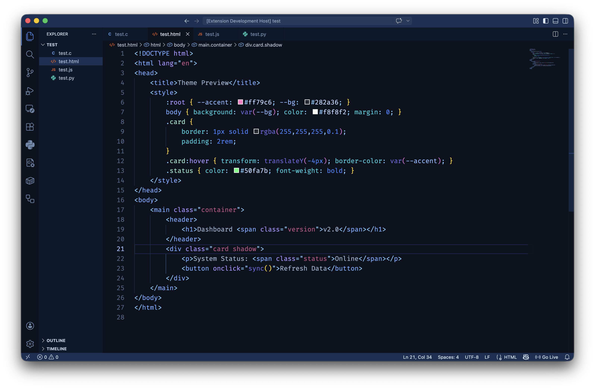
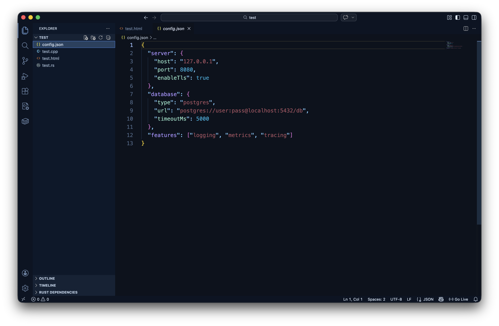

# Blueberry Night Theme

Blueberry is a dark VS Code theme built around deep navy backgrounds with blueberry blue accents, plus balanced purple, mint, and rose token colors for clear syntax separation.

## Highlights

- Deep, low-glare editor background tuned for long coding sessions
- Strong UI consistency across tabs, side bar, activity bar, panel, and terminal
- Language-aware semantic highlighting support for property tokens
- Curated token palette for JavaScript/TypeScript, JSON, Markdown, HTML, and CSS

## Screenshots

Here is how the theme looks in action:

## Install

1. Open Extensions in VS Code.
2. Search for Blueberry Night.
3. Click Install.
4. Open Command Palette and run Preferences: Color Theme.
5. Select Blueberry Night.

## Palette Direction

- Base background: deep navy
- Primary accent: blueberry blue
- Secondary accent: cool purple
- Contrast accent: mint/cyan
- String accent: soft rose-brown

## Scope Notes

- DOM globals like document are tuned to blueberry blue.
- Object keys and property reads are tuned for readability in large objects.
- Control keywords are intentionally more purple to stand apart from identifiers.

## Feedback

Issues and suggestions are welcome. Please open an issue in the project repository with:

- language/file sample
- expected color behavior
- screenshot (optional but helpful)

## License

MIT
